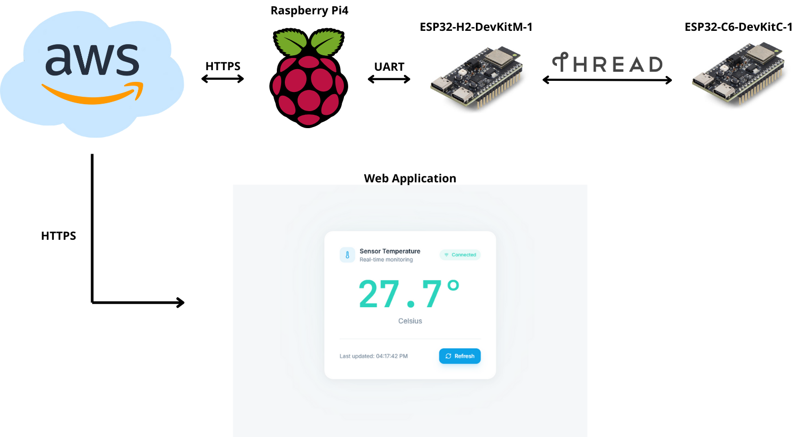

# IoT Thread System with AWS & ESP32



A complete end-to-end IoT system for data acquisition, analysis, and presentation using the **Thread protocol (IEEE 802.15.4)**, **OpenThread**, **AWS Cloud**, and a modern web application generated by **Lovable**.

## 📖 Project Overview

The goal of this project is to demonstrate a secure, scalable IoT architecture where low-power edge devices communicate via a mesh network (Thread) to a border router, which then forwards telemetry data to the cloud.

### Architecture Layers

1.  **Perception Layer:** **ESP32-C6** acting as a sensor node (End Device). It measures internal CPU temperature.
2.  **Edge Layer:** **Raspberry Pi 4** combined with **ESP32-H2**.
    - The RPi4 runs the **OpenThread Border Router (OTBR)**.
    - The ESP32-H2 acts as the **Radio Co-Processor (RCP)**.
3.  **Cloud Layer:** **AWS (Amazon Web Services)**.
    - **Lambda:** Serverless functions for writing/reading data.
    - **S3:** JSON storage for telemetry.
    - **IAM:** Security and access management via AWS Signature V4.
4.  **Presentation Layer:** A web application generated by **Lovable** (React/TypeScript) to visualize the data.

---

## 🛠 Hardware Requirements

- **Border Router:** Raspberry Pi 4 Model B.
- **Radio Co-Processor (RCP):** ESP32-H2-DevKitM-1.
- **End Device (Node):** ESP32-C6-DevKitC-1.
- USB cables for connection and power.

## 💻 Software & Technologies

- **ESP-IDF (v5.x):** Espressif IoT Development Framework.
- **OpenThread:** Open-source implementation of the Thread networking protocol.
- **AWS Services:** Lambda, S3, IAM.
- **Frontend:** React, TypeScript (via Lovable.dev).

---

## 🚀 Setup & Configuration

### 1. Edge Layer: OpenThread Border Router (OTBR)

**A. ESP32-H2 (RCP)**

1.  Flash the `ot_rcp` example from ESP-IDF to the ESP32-H2.
2.  Connect the ESP32-H2 to the Raspberry Pi via USB.

**B. Raspberry Pi 4 (Border Router)**

1.  Install Raspberry Pi OS.
2.  Clone the OTBR repository and run the setup scripts with the following flags (enabling Web GUI and NAT64):
    ```bash
    WEB_GUI=1 NAT64=1 NAT64_SERVICE=openthread ./script/bootstrap
    INFRA_IF_NAME=wlan0 WEB_GUI=1 ./script/setup
    ```
3.  Configure the serial connection in `/etc/default/otbr-agent`:
    ```bash
    OTBR_AGENT_OPTS="-I wpan0 -B wlan0 spinel+hdlc+uart:///dev/ttyUSB0?uart-baudrate=460800 trel://wlan0"
    ```
4.  Start the service: `sudo service otbr-agent restart`.
5.  **Form the Thread Network:**
    ```bash
    sudo ot-ctl
    > dataset init new
    > dataset commit active
    > ifconfig up
    > thread start
    ```

### 2. Perception Layer: ESP32-C6 (Node)

The ESP32-C6 runs a modified version of the `ot_cli` example.

**Key Features:**

- Reads internal temperature sensor.
- Synchronizes time via **SNTP** (required for AWS auth).
- Sends data via HTTPS PUT using **AWS Signature V4**.

**Installation:**

1.  Configure project settings in ESP-IDF (Set Console Output to USB Serial/JTAG).
2.  Flash the firmware.
3.  Join the Thread network using the network key from the OTBR:
    ```bash
    > dataset networkkey <YOUR_NETWORK_KEY>
    > dataset commit active
    > ifconfig up
    > thread start
    ```

### 3. Cloud Layer: AWS Configuration

**Architecture:**

- **Lambda (Writer):** Receives HTTP requests from ESP32-C6 and saves JSON to S3.
- **Lambda (Reader):** Reads the latest JSON from S3 for the frontend app.
- **Security:** IAM Users with strict policies (Example policy below):

```json
{
	"Version": "2012-10-17",
	"Statement": [
		{
			"Sid": "AllowTemperatureRead",
			"Effect": "Allow",
			"Action": ["lambda:InvokeFunction", "lambda:InvokeFunctionUrl"],
			"Resource": "arn:aws:lambda:REGION:ACCOUNT:function:NAME"
		}
	]
}
```
